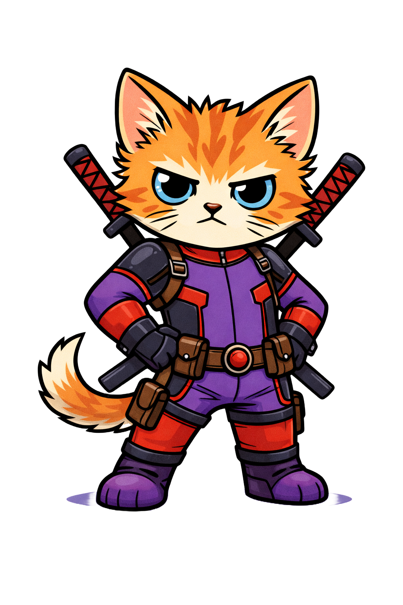

## SuperKitten


<div align="center">
    <br/>
    <em> This is SuperKitty, and she loves to MEOW <strong> (Maxamizing Effficient Operation's per Watt)</strong>, inspired by <a href="https://github.com/HazyResearch/ThunderKittens">ThunderKittens</a></em><br/><br/>
</div>


## Why?

Consumer hardware, especially apple silicon is immenstly power dense and underutilized with today's open source infrence/training supporitng libraries. SK is here to change that. 

Writing deep learning metal kernels should be easy; this library aims to do such that, without sacrificing performance for abstraction, it delivers the fastest compute (not theoretical), so you can sqeeze out maximum perf! It is .metal, headers and .c, and was developed with easy use in mind. It has an assortment of metal kernels so your chips don't starve!

Bridging the gap between bleeding intelligence and consumer hardware!

This is superkitty, and she loves to MEOW! - **Maxamizing effficient operation's** per **Watt**

It is:

1. **Simple**

SuperKittens is straightforward to write and works seamlessly out the box with your existing apple silicon code running 
on any of the M(1, 2, 3, 4, 5) chips.

2. **Fast**

The aim was never sacrificing perf for easier abstractions, we didn't! In opposite, we aim to provide simpler, yet 
much faster kernels that are still performant. 


# Supported Chips
April 2026:

* We currently only support M1 and M2 and are in the process of adding support for M2+.


## Quickstart

```bash
git clone https://github.com/Lazarus-931/SuperKittens.git
cd SuperKittens
./build.sh                          # compiles Metal kernels → build/libsk.metallib + libsk.dylib
```

```python
import numpy as np
from sk.src.py import activation

x = np.random.randn(512, 1024).astype(np.float16)
y = activation.gelu(x)              # dispatches Metal kernel via ctypes → libsk.dylib
```

Requires: macOS, Xcode 16+ (or Command Line Tools), `xcrun metal`.

### Benchmarking

Kernels & their respetive benchmarks done

[INSERT TABLE HERE, ROWS ARE KERNELS, CHIPS ARE COLS]

### What's coming

The whole point of SuperKittens is giving you fast, composable Metal primitives you can drop into any project — a Swift app, a C++ inference engine, whatever. No framework lock-in, just headers and shaders.

Here's where we're headed:

- **Templated attention** — support any head dim (64, 96, 128, 256) and sequence length out of the box, not just hardcoded configs
- **Causal masking** — fused into the attention kernel, not bolted on after
- **Multi-head and GQA** — batched heads with grouped-query attention so you can run real models
- **GEMM for common inference shapes** — not trying to be a general BLAS, just the shapes that actually show up in transformer inference
- **One include, everything works** — `#include "superkittens.h"` gives you BlockMMA, Tile, Frag, loaders, and every fused kernel. Compose them into your own stuff or use the ready-made ones
- **Docs that actually help** — examples showing how to build a custom kernel from the primitives, not just API reference
